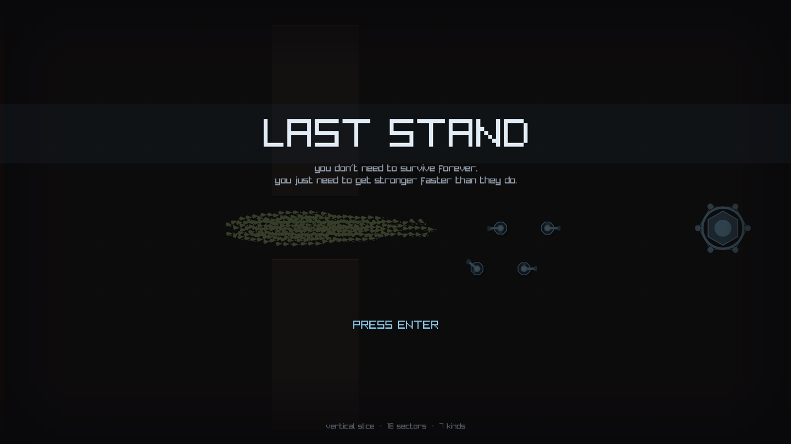
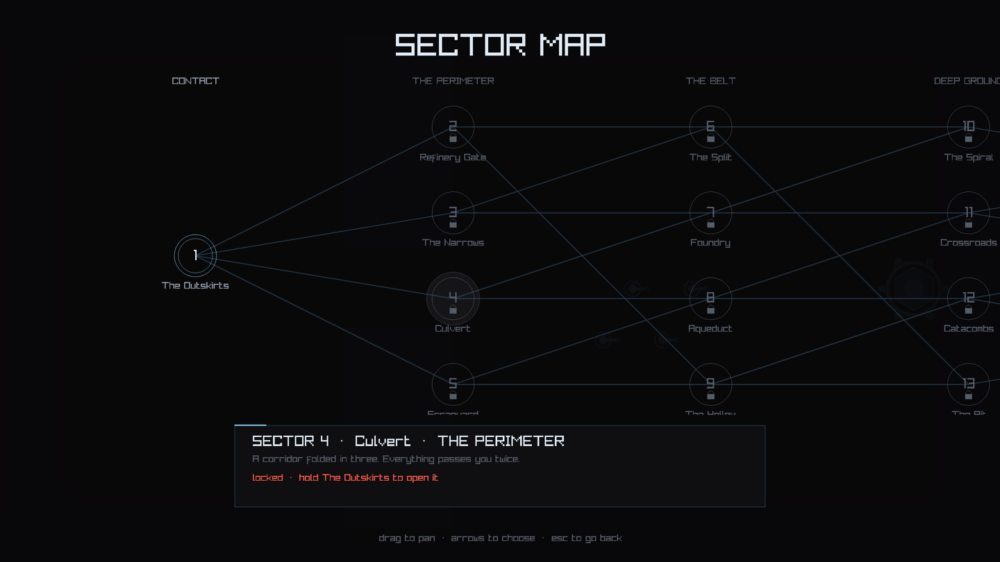
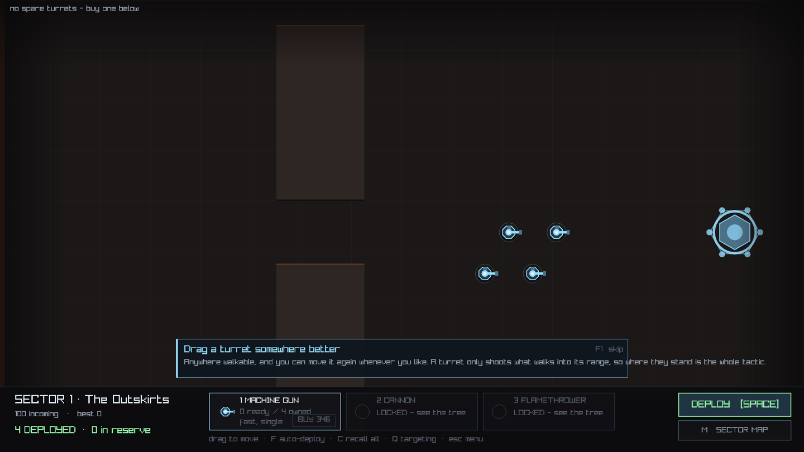
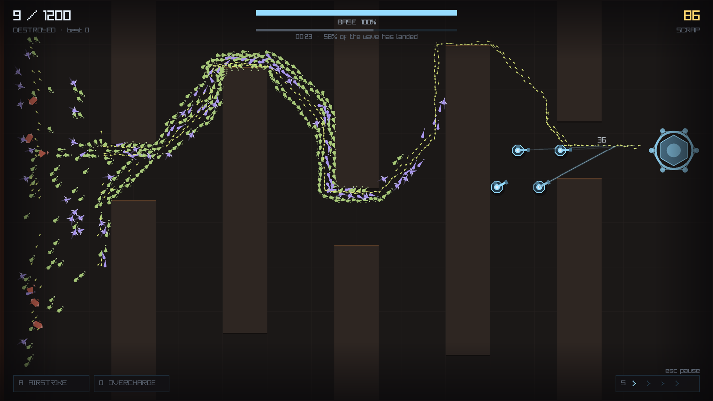
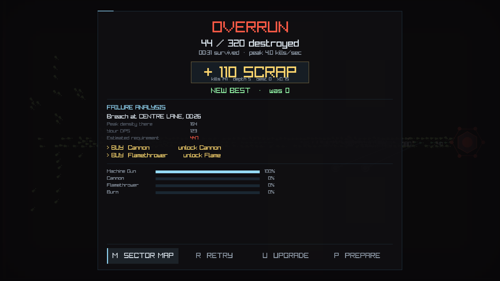
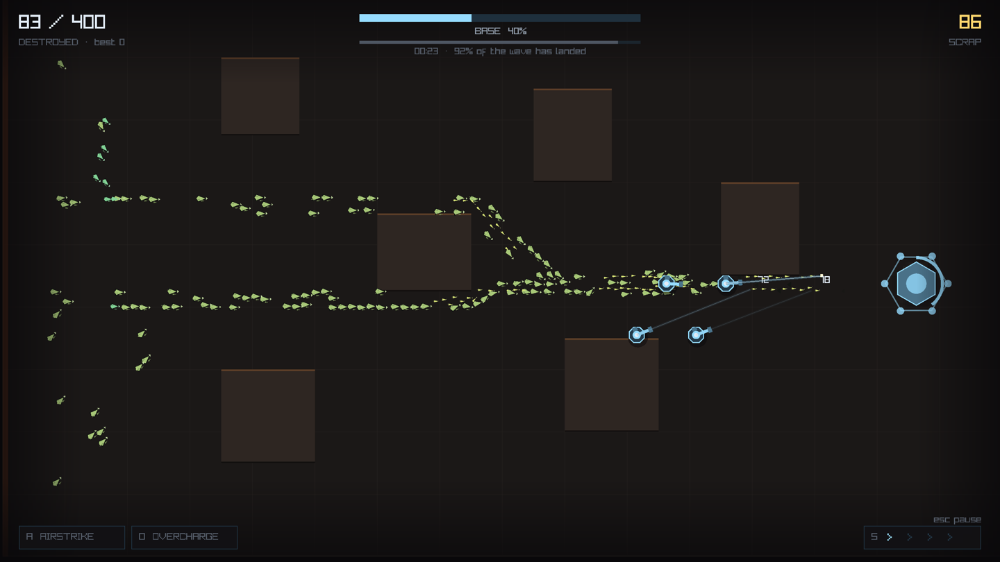
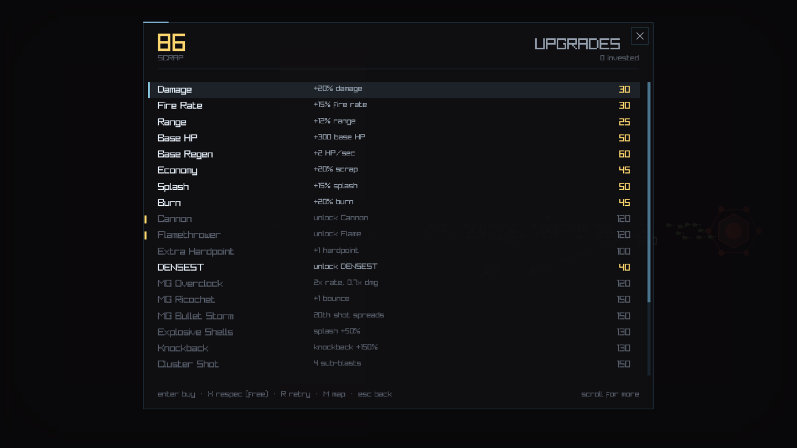

# LAST STAND

An incremental tower-defense game written in **C++20**, built around one
constraint: simulate tens of thousands of independent agents at 120 fps on a
single core before reaching for a thread pool.

> *You don't need to survive forever. You just need to get stronger faster
> than they do.*



The title screen's background is a live battle, dimmed. The simulation is fast
enough to be a menu backdrop, so it is one.

---

## Contents

- [What it is](#what-it-is)
- [The technology](#the-technology)
- [Architecture](#architecture)
- [The simulation](#the-simulation)
- [Performance, measured](#performance-measured)
- [Game design](#game-design)
- [Presentation](#presentation)
- [Verification](#verification)
- [Repository layout](#repository-layout)
- [Build and run](#build-and-run)

---

## What it is

A horde walks at your base. You place guns. You almost certainly lose the
first few times, and losing pays — so you buy something permanent and try
again. The loop is **battle → report → upgrade → retry**, and the retry path
is one keypress from either end of it.

Four screens carry the whole game.

| | |
|---|---|
|  | **Sector map.** Eighteen sectors on six difficulty tiers, drawn as the graph they actually are. Cleared ones are filled, open ones outlined, locked ones padlocked. Drag to pan. |
|  | **Prepare.** Turrets are things you own, not slots you fill. Put them anywhere walkable and drag them whenever you change your mind. The coaching band is the first-run tutorial. |
|  | **Battle.** Catacombs, mid-invasion: green Grunts, violet Phantoms and red Brutes threading a maze of offset gaps. Nothing here is scripted — it is a flow field and a separation force. |
|  | **Battle Report.** Where you were breached, when, by how much you missed, and which two nodes close the gap. Losing pays, and the report is where the payment is explained. |

---

## The technology

| | |
|---|---|
| **Language** | C++20 (`CMAKE_CXX_STANDARD 20`), compiled with `-Wall -Wextra -Werror -Wshadow -Wconversion -Wsign-conversion` |
| **Rendering / input / audio** | [raylib 5.5](https://www.raylib.com/), with `rlgl` used directly for batched immediate-mode geometry |
| **Build** | CMake 3.21+, single command, dependencies fetched via `FetchContent` — no vendored trees, no submodules |
| **Tests** | [doctest 2.4.11](https://github.com/doctest/doctest), 320 cases, run through `ctest` alongside two shell-script policy checks |
| **Assets** | **None.** No textures, no meshes, no audio files. Every visual is triangles and every sound is synthesised at launch from a spec |
| **Platforms** | macOS and Linux; Windows should work but is not part of the verification loop |
| **Dependencies beyond raylib and doctest** | none |

The "no assets" line is a design constraint rather than a boast: it keeps the
build to one command, it keeps the art tunable by constant rather than by
re-export, and it means every visual decision in the game is in the repository
as code you can read.

### Determinism is a compiler setting too

The build sets `-ffp-contract=off`. Left on, the compiler fuses a
multiply-add at `-O2` and not at `-O0`, and the same source produces different
floats in Debug and Release — which quietly breaks replay, the golden-hash
tests, and any bug report that says "it happened at tick 4,120".

---

## Architecture

### The layering rule

```
        ┌─────────────────────────────────────────────┐
        │  app/     Session, CLI, benchmark, balance  │
        ├──────────────┬──────────────────────────────┤
        │  ui/         │  render/   audio/   fx/      │
        ├──────────────┴──────────────────────────────┤
        │  gameplay/   Level, UpgradeTree, Telemetry  │
        ├─────────────────────────────────────────────┤
        │  sim/  ai/  math/  core/  persist/          │
        │  ── no raylib, no rendering, no input ──    │
        └─────────────────────────────────────────────┘
```

`sim/`, `ai/`, `math/`, `core/`, `gameplay/`, `persist/` and `fx/` may never
include `raylib.h`, `render/`, `ui/` or `audio/`. This is not a convention —
`tools/check_layering.sh` runs as a ctest case and fails the build.

One property buys a lot: the simulation contains no rendering, no input and no
wall-clock time. That is what makes headless benchmarking, deterministic
replay, a scriptable balance harness and reproducible bug reports possible, and
all four of those are load-bearing in this project.

### Typed SoA pools, not a generic ECS

```cpp
class EnemyPool {
    std::vector<Vec2>    position;      // hot: touched every tick
    std::vector<Vec2>    prevPosition;
    std::vector<Vec2>    velocity;
    std::vector<float>   health;
    std::vector<uint8_t> type;
    std::vector<float>   speed;
    std::vector<float>   burnDps, burnTtl, phase;
};
```

Fixed capacity, sized once, never resized. Removal is a swap with the last
live element — O(1), and it does not preserve order, which nothing depends on.

Every entity kind in the game is known at compile time and none needs runtime
composition. An archetype ECS here would be a month of work solving a problem
this game does not have. The arrays are public by design: systems iterate them
directly in tight loops, and a getter per field would be ceremony over a
`float*`.

### Virtual dispatch scales with the number of *kinds*, not of *things*

Turret targeting strategies are virtual — a few dozen calls a second, and the
polymorphism buys real clarity. Enemies have **no virtual functions at all**:
at 50,000 entities × 60 Hz that would be three million dependent loads per
second to answer a question a `switch` on a type byte answers for free.

Enemy behaviour is a `constexpr` table indexed by that byte:

```cpp
constexpr EnemyStats kTable[kEnemyTypeCount] = {
    // hp     speed  armor burnRes arrMul regen crowd weave scale
    { 100.0f,  40.0f, 0.0f, 0.00f, 1.0f,  0.0f, 1.0f,  0.0f, 1.00f},  // Grunt
    {  18.0f, 130.0f, 0.0f, 0.00f, 1.0f,  0.0f, 0.25f, 0.0f, 0.55f},  // Swarmer
    { 900.0f,  30.0f, 7.0f, 0.35f, 1.0f,  0.0f, 1.2f,  0.0f, 1.30f},  // Brute
    // …
};
```

### Zero heap allocation inside a battle

Every per-tick scratch buffer is owned by `World` and sized at construction:
the separation force accumulator, the burn snapshot, the death log. A replaced
global `operator new` counts allocations while armed, and three battles —
plain, burning-and-exploding, and Session-driven with abilities firing —
allocate **exactly zero times** across thousands of ticks. That is a test, not
an intention.

---

## The simulation

### Flow-field pathing

One Dijkstra pass from the base at map load produces a grid where every cell
stores a direction down the cheapest route. Per-agent movement is then an O(1)
grid sample plus a local separation force:

```
  desired = flowfield.sample(position) * speed     // where the map says to go
          + separation(neighbours) * strength      // don't overlap my neighbours
          → resolved against walls
```

Per-agent A* at these counts is not slow, it is impossible. The flow field also
produces the emergent behaviour the design wants for free: the horde compresses
at chokepoints, streams along walls and piles up behind obstacles, with no
authored crowd logic anywhere.

### Two rules that exist because their absence hung the game

**Everything that moves an enemy must resolve against walls.** The flow field
is zero *inside* geometry, so anything that ends up in a wall stands there for
the rest of the battle — alive, which means the victory condition never fires
and the run hangs forever. Separation shoves people into walls in a dense
chokepoint. So did cannon knockback. Both now go through one function,
`slideAlongWalls`.

**And, as a backstop, being stuck is not a state the game can persist in.** An
enemy with no flow at all is handed a heading toward the nearest reachable
cell. Trusting that nothing can ever put an enemy in a wall is what caused this
twice.

### The spatial hash

A uniform grid built by counting sort, rebuilt twice per tick — once over the
positions separation is about to read, once over the positions movement just
wrote. An O(n + cells) rebuild costs far less than either consumer querying
stale cells would cost in correctness.

Cell size is tuned for the *hot* query, not the widest one. Separation runs `n`
times a tick with a radius of 12; turret acquisition runs a few dozen times
with a radius of 160. Measured at 5,000 entities: 64 → 1.90 ms, 32 → 1.55,
16 → 1.25, **12 → 1.17**, 8 → 1.13. Below 12 the curve flattens while the cell
array quadruples.

Queries are callback-based (`forEachInRadius`) rather than returning a shared
buffer. The buffer version had a real bug in it: DENSEST targeting nests a
query inside a query, and the inner one clobbered the outer one's results.

### Deterministic fixed timestep

60 Hz, PCG32 for all simulation randomness, FNV-1a state hashing. Hitstop
withholds whole ticks rather than scaling `dt`, so juice cannot reach the
simulation — screenshake is a `Camera2D` offset, and particles, corpses and
damage numbers live in `fx/`, which the layering test forbids from including
raylib.

---

## Performance, measured

Mean tick time, MacBook Pro M5, Release, 1,200 ticks per rung. Every row is a
committed `--sweep` run in [`docs/bench/`](docs/bench/), not a recollection.

| entities | stage 0 — naive | stage 1 — spatial hash | stage 2 — cell pairs | total |
|---:|---:|---:|---:|---:|
| 100 | 0.020 ms | 0.013 ms | 0.010 ms | 2.0× |
| 500 | 0.165 ms | 0.076 ms | 0.033 ms | 5.0× |
| 1,000 | 0.597 ms | 0.183 ms | 0.075 ms | 7.9× |
| 2,000 | 2.378 ms | 0.420 ms | 0.178 ms | 13.3× |
| 5,000 | **14.717 ms** | 1.245 ms | **0.568 ms** | **25.9×** |

**Stage 1** replaced the O(n²) pairwise separation loop with a spatial-hash
neighbourhood query. **Stage 2** stopped computing every interaction twice:
separation force is antisymmetric, so the pass walks *cell pairs* rather than
entities and applies each interaction to both ends.

The naive loop is still there behind `--naive-separation`, so the baseline is
reproducible rather than a claim in an old commit message.

### The stages that did not pay

Packing positions into the hash's cell order changed nothing measurable
(1.2321 → 1.2280 ms) — a 40 KB position array already lives in L2. Later,
denormalising two per-kind constants into per-entity arrays to shorten an
indexed load also measured as nothing. Both are documented in
[`docs/superpowers/plans/`](docs/superpowers/plans/) alongside the ones that
worked, because an optimisation notebook that only records the wins is a
sales brochure.

### The measurement trap, which cost an afternoon

**Copy the binary before you benchmark it.** On macOS the executable the linker
just wrote is scanned on every exec; a byte-identical copy is not.
`build/laststand` measured **0.93 ms** against `build/laststand-copy` at
**0.66 ms** — same directory, same ad-hoc signature, same md5.

This produced a convincing 35% "regression" that survived reverting the
suspect code, a clean rebuild, and finally grafting the entire new `src/` onto
the previous commit's build directory, where it ran at baseline speed. The
check that ends this argument is A/B-ing two binaries with the same md5.

---

## Game design

### Four pillars

1. **Start pathetic, end absurd.** Progress should be visible in the number of
   things dying, without reading a stat sheet. A campaign spans 100 enemies to
   4,200.
2. **Losing pays.** A defeat is a transaction, never a punishment. It earns
   75% of the identical victory, and a personal best pays even on a loss.
3. **The horde is a fluid.** Enemies are not scripted; the crowd behaviour is
   emergent from a flow field and a separation force.
4. **Builds, not stat sheets.** Upgrades change *mechanics* — a bullet that
   bounces, a shell that splits into four — rather than adding percentages.

### The campaign is a graph

Eighteen sectors on six tiers, **1 / 4 / 4 / 4 / 3 / 2**. Every sector past
the first names **two parents** and opens as soon as *either* has been held,
so the tiers fan out and converge and there are many routes to the end.
Requiring both parents would have been a corridor with extra ceremony.

```
   I        II          III           IV            V           VI

                     ┌── Split ──┬── Spiral ──┬─ Gauntlet ─┬─ Open Ground
          ┌ Refinery ┤           │            │            │
          │          ├── Foundry ┼─ Crossroads┼─Meatgrinder ┤
          ├ Narrows ─┤           │            │            │
Outskirts ┤          ├─ Aqueduct ┼─ Catacombs ┼─ Causeway ──┴─ The Breach
          ├ Culvert ─┤           │            │
          │          └── Hollow ─┴── The Pit ─┘
          └ Scrapyard
```

The parent of any sector always sits on an earlier tier, which is the single
rule that keeps the graph acyclic — a cycle would be a sector that can never
unlock, invisible until a player got stuck on it. A test checks the rule, and
that every sector is reachable.

**The map draws itself from that graph**, so adding a sector to
`gameplay/Level.cpp` puts it on the board wired to its parents and laid out by
tier. And the map is the campaign's hub, not a menu: winning a sector does not
hand you the next one, it sends you here. In a campaign that branches, choosing
where to go *is* the decision, and a "NEXT SECTOR" button quietly makes it for
you.

Each of the eighteen maps is a distinct flow problem rather than a reskin: one
lane through a chokepoint, two lanes converging, an S-folded corridor, three
sealed lanes, an open bowl, a maze of offset gaps, four corners onto a centre,
a ring corridor, a bridge, no cover at all.

### Seven enemies, each breaking a different lazy build



*Scrapyard: Swarmers (small, pale, packed tight) arriving as a tide among the
Grunts. Crowding is a movement parameter, so the difference is visible before
you read a single number.*

| kind | hp | speed | mechanic | punishes |
|---|---:|---:|---|---|
| **Grunt** | 100 | 40 | — | nothing — baseline mass |
| **Runner** | 40 | 100 | — | low fire rate, rear-only coverage |
| **Tank** | 2,000 | 12 | armour 3 | pure-AoE with no single-target DPS |
| **Swarmer** | 18 | 130 | crowding 0.25 | single-target DPS |
| **Brute** | 900 | 30 | armour 7, 35% burn resist | fast weak guns |
| **Phantom** | 260 | 62 | 85% burn resist, weave | a wall of flamethrowers |
| **Behemoth** | 9,000 | 9 | regen 55/s, arrival ×2.5 | insufficient sustained DPS |

**Armour is subtracted per hit**, not as a percentage. That is what makes it a
different question rather than a bigger one: a Machine Gun doing 5 a shot into
7 points of armour is scraping the 15% floor, while the same total DPS
delivered as one Cannon shell barely notices. It is also the only thing that
makes **Armor Piercing** worth buying — the node *divides the armour* rather
than multiplying damage, so it is worth exactly as much as the armour it meets
and nothing at all against a Grunt.

Each kind debuts **alone**, in a sector that introduces nothing else. Meeting
armour for the first time alongside weaving and swarming teaches nothing. This
is asserted in `tests/test_level.cpp`, not merely intended.

### Difficulty is composition, not multiplication

The original design said enemy *count* was the primary difficulty knob. That
turned out to be measurably wrong, and the campaign it produced was the
evidence: totals climbed an order of magnitude across eight sectors and every
sector after the third fell first try.

Count scales the player's kill count, and therefore their income, at least as
fast as it scales the threat. The two curves cancel and what is left is a
longer battle, not a harder one. Health multipliers stay small (1.0 to 4.5
across the whole campaign) and do the fine tuning; the roster does the work.

### The economy, and the bug in it



24 nodes: eight repeatable stat nodes and sixteen one-shot behaviour and unlock
nodes. Costs grow 1.42× per level; the strong multipliers grow more slowly than
they used to.

```
scrap = (kills × killValue × scrapMult)
      + (depthWeight × progress²)
      + personalBestBonus
      , all × the defeat / diminishing-replay factor
```

`killValue` **falls with the sector's tier**, from 4.00 in the first to 0.85 in
the last. This is the fix for a specific measured failure. A flat kill value
makes income *linear* in enemy count while the upgrade tree makes damage
*exponential* in Scrap. Those curves cross, and after they cross the game funds
itself: every purchase is affordable the moment it is wanted, the player is
never broke, and the remaining sectors are a formality.

### Two instruments, because the curve is measured rather than asserted

**`--balance N`** plays the whole campaign headlessly with an auto-player that
follows the game's own Failure Analysis advice when it can afford it, buys the
cheapest node when it cannot, and takes whichever sector the game suggests
after each clear:

```
run  sector  result   kills        time   payout  x     bought  scrap
  1       1  loss        27/100      45s       86  0.75      3      1
  9       2  CLEAR      250/250      57s     1250  1.00      7     48
 12       6  CLEAR      700/700     153s     3553  1.00      4     32
 17      10  CLEAR     1300/1300    170s     6749  1.00     13     69
 20      17  CLEAR     3800/3800    155s    17538  1.00      4    313
```

Note the `scrap` column: the player ends nearly every run **broke**. That is
the condition under which an upgrade is a decision.

**`--matrix`** answers the question a playthrough cannot. A campaign only ever
tests one budget per sector — whatever the auto-player happened to arrive with
— so it cannot tell you whether the last sector is a challenge, because that
depends entirely on what you bring. The matrix drops a *fresh* player onto
every sector at a spread of fixed budgets:

```
sector                     tier      400     1500     5000    15000    40000    80000
 1 The Outskirts              1    CLEAR    CLEAR    CLEAR    CLEAR    CLEAR    CLEAR
 5 Scrapyard                  2      64%    CLEAR    CLEAR    CLEAR    CLEAR    CLEAR
 9 The Hollow                 3       5%      12%      80%    CLEAR    CLEAR    CLEAR
13 The Pit                    4       1%       3%      18%    CLEAR    CLEAR    CLEAR
16 Causeway                   5       0%       1%      12%    CLEAR    CLEAR    CLEAR
18 The Breach                 6       0%       1%       3%      42%      97%    CLEAR
```

Read down a column for the difficulty curve, across a row for what a sector
costs. The first sector falls to 400 Scrap; the last needs 80,000 — and at
40,000 it reaches 97%, which is the number a finale should print.

---

## Presentation

### Art direction: detailed vector, industrial sci-fi

Everything is triangles submitted through `rlgl`. Each enemy kind reads as a
different **shape** first and a different colour second, because at four
thousand bodies on screen colour alone is a smear: Swarmers are legless darts,
Brutes are slabs under pauldrons, Phantoms stream with a wake and no legs at
all, Behemoths are three segments on four counter-phased legs.

One bug worth naming, because it cost an afternoon twice: **backface culling
silently eats a triangle wound the wrong way.** No warning, no error — the
detail simply is not there. The natural way to read points off a sketch is
whichever way you drew it. `emit()` now normalises winding itself with one
cross product per triangle, so the class of bug is gone rather than fixed.

### Density-driven level of detail

Detail degrades by **local density**, not global count. A lone scout keeps its
outline, head, weapon arm and walk cycle while a chokepoint collapses to one
shape per enemy. Three tiers, chosen from spatial-hash cell occupancy:

```
lod_tiers      full 131  silhouette 1303  shape 3222
lod_triangles  8048   (all-full 32592, all-shape 4656)
```

Draw calls are a function of the number of *tiers*, not the number of things —
each bucket is submitted in one `rlBegin(RL_TRIANGLES)` span.

### Procedural audio

There are no audio files in this repository. All twelve voices are synthesised
at launch from a spec: an oscillator glide, a noise mix, a one-pole lowpass, an
envelope and a seed.

The hard problem at four thousand kills a minute is that one death sound per
enemy is unlistenable. Above a smoothed rate threshold, deaths and gunfire stop
playing individually and hand over to two continuous beds whose gain tracks the
rate, with the 32-slot voice cap spent on what you must not miss: the base being
hit, an ability landing, the UI answering you. The audio ends up reporting
progression on its own — the early game is individual pops, the late game is a
roar.

### UI principles

Hand-rolled immediate mode: the player-facing screens are rects, lines, text
and hit-testing, and a framework would add a dependency and a programmer-art
tell.

- **No modal dialogs.** Erasing a save takes two presses of the same button
  rather than a confirmation box.
- **Everything is skippable.** The report counts up, and any key completes it.
- **Keyboard-first, mouse-equal.** Hovering *moves* keyboard focus, so the two
  input methods never disagree about what is selected.
- **The interface reflows.** Positions come from the window size and lengths go
  through a UI scale, so the game fits its window live as you drag the edge.

### The first run

A tutorial that is nine lines of coaching rather than a wall of text: one
instruction at a time pinned to the bottom of whatever screen is up, each
advancing when the player *does* the thing rather than when they dismiss a
dialog. It teaches the loop — place, deploy, lose, spend, retry, win,
**choose** — and the last step is the one that matters, because a branching
campaign is worthless if the player never learns the map is a choice.

It never blocks anything, the panels it sits under shrink to make room for it
rather than being covered by it, `F1` dismisses it forever, and Options can ask
for it back without erasing the campaign.

---

## Verification

```bash
ctest --test-dir build --output-on-failure
```

320 doctest cases plus two policy scripts. Four are worth pointing at.

**The golden-hash determinism test.** Three fixed scenarios run a fixed number
of ticks from a fixed seed and are checked against hashes committed in the
test. Unlike comparing the simulation against itself, this also catches a
change that is deterministic but *wrong*. It passes identically in Debug and
Release. The scenarios pin their turret positions by hand rather than asking a
layout helper — a golden hash that moves when you tune a convenience has
stopped meaning anything.

**The zero-allocation assertion.** A replaced global `operator new` counts
allocations while armed; three battles allocate exactly zero times.

**The layering script.** Greps `sim/`, `ai/`, `math/`, `core/`, `gameplay/`,
`persist/` and `fx/` for any include of raylib, `render/`, `ui/` or `audio/`,
and fails the build. The evidence that the presentation milestone stayed
cosmetic is that the golden hashes from the milestone before it still pass
untouched.

**The glyph script.** raylib's default font is Latin-1 only, so a stray em
dash or curly quote in a string literal renders as a hollow box. Any character
above U+00FF in a literal fails the build.

Beyond those, the economy's *shape* is asserted rather than remembered: the
first loss must buy something, no more than two identical runs may occur back
to back, a run that spent Scrap may never come back smaller, the player must
stay broke while sectors remain, every sector must be clearable at some budget,
and nothing in the last two tiers may be clearable on pocket change.

### Reproducible captures

Every screenshot in this README was produced by the game itself, not by a
screen grab:

```bash
./build/laststand --shot 4 --shot-screen tree --shot-out tree.png --width 1440 --height 810
```

`--shot-level` picks a sector (the later enemy kinds only appear deep in the
campaign) and `--shot-tutorial` keeps the coaching band visible. Capturing at
the size players actually get matters: two layout collisions in this project
were invisible at 1600 wide and obvious at 1280.

---

## Repository layout

```
src/
  math/      Vec2, Rect, PCG32
  core/      fixed timestep accumulator
  sim/       World, EnemyPool, movement, combat, spatial hash, maps
  ai/        flow field
  gameplay/  levels and the campaign graph, upgrade tree, economy, telemetry
  persist/   versioned binary save with forward migration
  fx/        particles, corpses, damage numbers, hitstop and shake
  render/    renderer, LOD, icons, viewport, theme
  ui/        immediate-mode widgets and every screen
  audio/     synthesiser, mixer, voice limiting
  app/       Session, tutorial, CLI, benchmark, balance harness
tools/       layering and glyph policy scripts
docs/        GDD, benchmark CSVs, plans, screenshots
tests/       320 doctest cases
```

The save is a fixed-width little-endian binary at version 6, written
atomically — serialise to a temp file, `fsync`, rename over the target. Every
older version is accepted and upgraded in place with the fields it predates
left at their defaults. Refusing to read a player's entire progress because the
game grew a volume slider is the worst possible bug.

Design document: [`docs/GDD.md`](docs/GDD.md).

---

## Build and run

Requires **CMake 3.21+** and a **C++20 compiler**. Both dependencies are
fetched at configure time, so there is nothing to install first.

```bash
cmake -B build -DCMAKE_BUILD_TYPE=Release
cmake --build build -j
./build/laststand
```

### Controls

Menus take the arrow keys, the mouse, `ENTER` and `ESC`.

| key | action |
|---|---|
| click / drag | place a turret anywhere walkable, or pick one up and move it |
| right-click | recall a turret into the arsenal |
| `1` `2` `3` | pick Machine Gun / Cannon / Flamethrower |
| `F` / `C` | deploy everything in reserve / recall it all |
| `Q` | cycle targeting mode (First → Closest → Strongest → Densest) |
| `M` | sector map — from Prepare, the report, the tree, or paused |
| `SPACE` / `ENTER` | deploy — allowed with turrets still in reserve |
| `S` | cycle time scale 1× → 2× → 4× |
| `A` | airstrike the densest lane (if unlocked) |
| `O` | overcharge the turret under the cursor (if unlocked) |
| `ESC` | pause (battle) · back (menus) |
| `R` | retry — restart the sector with the same loadout |
| `U` | open the upgrade tree (from the report) |
| `X` | respec all (tree) |
| `F1` | dismiss the tutorial |
| `F` `G` `T` | debug: flow field / grid / range rings |

Scrap, the 24-node tree, per-sector bests and your options persist to
`laststand.save`.

### Command-line tools

```bash
# Headless simulation benchmark — no window, no renderer.
./build/laststand --bench --ticks 10000 --spawn 5000

# The whole entity-count curve to a CSV.
cp build/laststand /tmp/measure                 # see "the measurement trap"
/tmp/measure --sweep docs/bench/m7.csv --stage stage5

# The M5 baseline, for reproducing the optimisation numbers.
./build/laststand --bench --spawn 5000 --naive-separation

# Render timing (needs a desktop session).
./build/laststand --render-bench 5000 --no-lod --no-batch   # the naive path
./build/laststand --render-bench 5000                       # LOD + batching

# Economy and difficulty.
./build/laststand --balance 20
./build/laststand --matrix

# Reproducible screenshots.
./build/laststand --shot 4 --shot-screen levels --shot-out sectors.png \
                  --width 1440 --height 810
```
